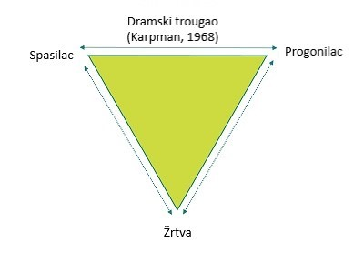

Dramski trougao je socijalni model ljudske interakcije, koji mapira destruktivne interakcije među ljudima, koje ih vode u dublji konflikt i nesporazum u komunikaciji. Značajan je alat u psihoterapiji, kako u [Transakcionoj analizi](/blog/psihoterapijski-pravci/osnovni-principi-transakcione-analize/), u kojoj se pretežno koristi, tako i u drugim psihoterapijskim modalitetima. Osnivač ovog modela je Stiven Karpman

**Psihološke Igre**

Samim posmatranjem ovog modela, uočavamo tri koncepta koji predstavljaju tri tipične psihološke uloge koje ljudi zauzimaju kada igraju Igre. Te uloge su – Progonilac, Spasilac, Žrtva. Iako će koncept Igara biti opisan u nekom od narednih tekstova, da bi čitalac razumeo Karpmanov Dramski trougao, neophodno je da se i sada dotaknemo tog koncepta. 

Igre predstavljaju niz skrivenih razmena u komunikaciji, i kada govorimo o nesvesnim obrascima pisaćemo je velikim početnim slovom – Igra

Postoje dve vrste psiholoških igara koje ljudi igraju: svesne i nesvesne. Svesne igre (manipulacije ili prevare) su one u kojima je osoba koja započinje igru svesna svog skrivenog cilja, ali se namerno pretvara ili glumi, da bi ostvarila svoju dobit. Dobit može biti praktična ili simbolična. Praktična dobit može biti novac, seks, uticaj na važne odluke, dok kod simbolične dobiti nema nikakve praktične koristi – igrač može prevariti nekoga da bi pred svima dokazao da je on glup. Logika ove dobiti je: “Pokazaću da je on glup da bih ja ispao pametan”. 

Za razliku od svesnih igara, nesvesne Igre su one u kojima igrač nije svestan da igra Igru, već čvrsto veruje da je to ponašanje koje zovemo Igra uvek van njegove moći, da mu se “dešava” i da su drugi odgovorni za to ili da je takvo ponašanje deo njegove ličnosti. Osnovna karakteristika nesvesne Igre jeste ponavljanje, bilo da je u pitanju ponavljajući obrazac u komunikaciji sa samo jednom ili sa više osoba. Ponavljanje istog ponašanja daje iste negativne rezultate i na kraju završavate sa istim osećajem nelagodnosti, nemoći i obeshrabrenosti. Igra se uvek završava na predvidiv način i za nju je karakterističan Obrt iz jedne uloge u drugu

**Karakteristike Dramskog trougla**

Dramski trougao čine tri glavne uloge: Progonilac, Spasilac i Žrtva. Sve tri uloge su patološke i zato ih pišemo velikim slovom, da bismo ih razlikovali od zdravih uloga.

Za ovaj koncept značajno je, kao što sa slike možemo videti, da su strelice usmerene od jedne, ka drugoj ulozi, što znači da se ljudi mogu na različite načine kretati po Dramskom trouglu. Pored toga, svako može imati svoju “preferiranu ulogu”, dominantnu, onu u kojoj provodi većinu vremena.

**Progonilac:** kada je osoba u ulozi Progonioca, polazi iz pozicije Ja sam u redu, ti nisi u redu. Osnovna osećanja Progonioca su prezir i mržnja. Često su ovo osobe koje su doživele neku vrstu nasilja kao deca. Ispoljavaju kontrolišuće, autoritarno ponašanje, uz često zauzet stav superiornosti. Kada se nađemo u ovoj ulozi skloni smo glasnom govorenju, naređivačkoj komunikaciji, ismevanju drugih, moralisanju, dok u prisustvu Progonioca imamo doživljaj da moramo da budemo posebno oprezni, i da pazimo na svoje reči i ponašanje, kako ga ne bismo razljutili i time sebe doveli u nevolju. Imperativ koji prati osobe koje zauzmu ovu ulogu je snažno osećanje da je potrebno da im ljudi udovolje, da zaslužuju poseban tretman, i da je neophodno da se pobrinu da i dobiju ono što žele, na bilo koji način. 

**Spasilac:** osobu koja zauzme ulogu Spasioca karakteriše visoko izražena potreba da ljudima oko sebe pomaže, preterana spremnost da se drugima ukaže pomoć, ili da se određeni zadatak obavi umesto nekog. U ulozi Spasioca na sebe preuzimamo stvari koje u suštini ne želimo da radimo, odgovornost koju ne želimo, ili posao koji nije naš, i postavlja se pitanje zašto bismo radili nešto što suštinski ne želimo? Ali naša nesvesna težnja nekad bude jača od nas samih, pa naš osećaj da nešto ne želimo da radimo, nadjača osećaj superiornosti do koga dođemo kada odradimo neki zadatak umesto drugoga, kada pomognemo osobi koja od nas nije tražila pomoć ili kada nas vodi misao da je naš zadatak da “spasimo” druge. Osobe u ovoj ulozi, često veruju da druga osoba ne bi mogla da se snađe ili preživi bez njih, što godi njihovom krhkom samopouzdanju

**Žrtva:** kao i kod prethodne dve uloge, i ovde moramo razlikovati Igričnu Žrtvu od stvarne žrtve. Stvarna žrtva je osoba kojoj su suštinski ugrožena neka prava ili integritet, dok je osoba u ulozi Žrtve sklona tome da otpisuje svoju odgovornost za ostajanje u nezadovoljavajućoj situaciji, ili da otpisuje sposobnost za izlaženje iz nje. Nju karakterišu pasivnost, čekanje Spasioca, koji bi je spasio od Progonioca, života, situacije ili sebe same. Osoba u ulozi Žrtve zanemaruje svoje kapacitete i potencijale, otpisuje svoju sposobnost da misli, reši problem ili utiče na ishod nepovoljnih okolnosti.

**Dinamika uloga i Igara**

Sve pomenute uloge utiču jedna na drugu, svaka predstavlja “poziv” ovom drugom na interakciju, i uzajamno su povezane i komplementarne. Kako smo već gore pomenuli, moguće je lako preći iz jedne uloge u drugu

Analizirjući Igre i sam Karpamnov trougao, ne smemo ispustiti iz vida da su Igre nesvesne, ali ni to – da je naša odgovornost da ove mahanizme osvestimo. 

**Kako da znate da ste u Igri?**

- "Uvek naletim na iste muškarce.”
- “Samo se svađam sa mamom, i ni sa kim više.”
- “Meni se uvek dešavaju iste stvari.”
- “Ovu situaciju sam doživela već sto puta, ne znam šta više da radim!”
- “Samo sam želela da mu pomognem, kako je nezahvalan...”
- “Ovaj život je tako nepravedan i uvek se meni nešto iskomplikuje.”

Kada čujete da neko u Vašoj okolini, ili Vi sami, izgovarate slične rečenice, već ste u Igri, već ste deo nje, i pitanje je trenutka kada ćete primetiti da se nešto neočekivano dalje dešava.

Kada, za početak, postanete senzitivni za rečenice slične ovima, moći ćete da pređete na sledeći zadatak – prihvatanje odgovornosti, a potom i osvešćivanje. Prihvatanje odgovornosti bi značilo da prepoznate na koje sve sve načine Vi odgovorni što se nalazite u takvim situacijama, odgovornosti koja se tiče izbora okoline, posla, situacija, a koje su izvor nezadovoljstva. Odgvoronost isključuje uverenje da su Vam drugi ljudi nešto učinili, ili da su oni “krivi” što se Vi osećate baš tako, a osvešćivanje se odnosi na to kako ste sebe doveli u takvu situaciju, kako ste se okružili takvim ljudima, šta za Vas znače pomenute uloge... Osvestiti takođe znači i vratiti se korak unazad, i zapitati se u kom trenutku sam “zaključio” da svet i drugi ljudi tako funkcionišu, ali i trenutak kada sam shvatio da ću takvim ponašanjem obezbediti da “psihološki preživim”.

Čini se kao mnogo posla, i mnogo odgovornosti, ali ako Vam kažem da je to jedini način da stanete na put Igrama i prekinete začarani niz – jeste li zainteresovani?

Jelena Bojkovska